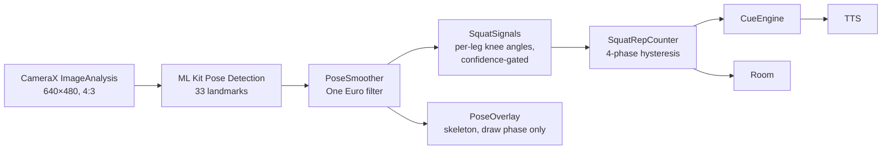
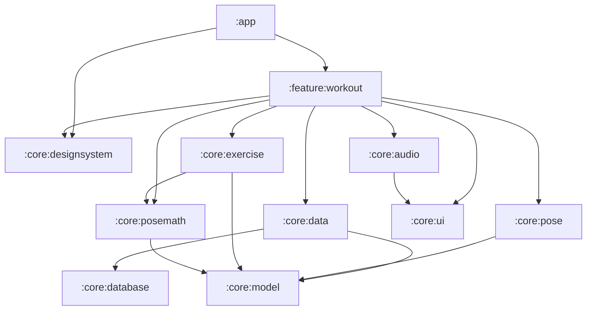

# RepLens

**Your phone counts your reps, logs your workouts, scores your form, and shows you
the rep you got wrong.**

An AI personal trainer for Android. The camera watches you train, on-device ML
tracks your pose, and the app coaches you out loud — because from three meters
away the screen is unreadable.

*"Every rep, seen."*

> **Status: in development.** Not on Google Play yet, and not ready to be. The
> squat is implemented end to end — counting, voice coaching and local history all
> work on a device — but there is no history or stats UI, no backend, and only one
> exercise. See [`docs/status.md`](docs/status.md) for exactly where things stand.

## What works today

- **Rep counting from the camera**, validated on device against recorded footage.
- **Voice coaching** — setup guidance, a count-in, every rep called out, and a
  set summary. Music ducks rather than stops. A set is startable and finishable
  by ear alone, which is the point.
- **Form cues** for shallow reps and abandoned descents.
- **Depth scoring**, graded separately from counting, so ten shallow reps read as
  *"10 reps, depth 42%"* rather than *"0 reps"*.
- **Local history** — sets, reps and inferred workout boundaries persisted to
  Room, surviving process death.
- Front/back camera, ultra-wide zoom for small rooms, and a live skeleton overlay.

## How it works

Every frame runs the same pipeline, at ~27 fps on a Pixel 10 Pro XL:



The frame rate *is* the inference rate — ML Kit holds the image until detection
finishes, so there is no pipelining. Everything downstream of the detector costs
about a microsecond.

## Some decisions worth reading about

The reasoning behind these lives in [`docs/decisions.md`](docs/decisions.md).

- **Counting and depth-scoring are separate questions.** One threshold forces a
  bad trade: strict enough for true parallel and most casual reps don't count;
  lenient and quarter-squats do. So the counter is deliberately forgiving and
  quality is graded afterwards from the angle. → [thresholds](docs/decisions.md#squat-thresholds)
- **Kalman was simulated and rejected** in favor of a One Euro filter. A
  constant-velocity model assumes motion continues — but a rep is a sequence of
  direction reversals, so it is wrong exactly where the counter cares.
  → [smoothing](docs/decisions.md#smoothing-kalman-rejected)
- **ML Kit hallucinates a confident skeleton.** At 20 cm it does not report "no
  body"; it invents one, and carrying the phone sweeps those fake joints through a
  clean rep. There is no confidence to tune, so every gate is geometric.
  → [what ML Kit does](docs/decisions.md#what-ml-kit-does)
- **Fixtures are CSVs of derived signals, not landmark dumps.** A time series of
  knee angles is something you can plot and see five valleys in; 900 frames × 33
  landmarks is something nobody can debug.
- **DTOs will be duplicated between client and server, not shared.** Mobile
  clients cannot be force-updated, so a shared module makes the compiler lie about
  compatibility. → [no `:shared` module](docs/decisions.md#no-shared-module)
- **Rep timings split at the turnaround, not at a threshold**, because the first
  device data showed the old split was measuring depth while claiming to measure
  tempo. → [rep timings](docs/decisions.md#rep-timings)

## Architecture

Pure-Kotlin core modules hold the domain logic — no Android imports, enforced by
compilation — so the interesting parts run on plain JUnit in milliseconds.



| module | responsibility |
|---|---|
| `:app` | Activity, camera permission gate, cross-feature wiring |
| `:feature:workout` | The workout screen, its ViewModel, and cue arbitration |
| `:core:model` | Pure data. No thresholds, no behavior, no dependencies |
| `:core:posemath` | Angles, distances, One Euro smoothing. Domain-free geometry |
| `:core:exercise` | Exercise knowledge: thresholds, gates, the rep state machine |
| `:core:pose` | CameraX + ML Kit behind a `Flow<PoseFrame>`. The only module that names either |
| `:core:audio` | Text-to-speech, locale negotiation, audio focus |
| `:core:database` | Room entities, DAOs, the database |
| `:core:data` | The repository and its mappers — the only module speaking both vocabularies |
| `:core:ui` | `UiText` and its resolvers |
| `:core:designsystem` | Theme, typography, wrapped components. The app's Compose gateway |

Each module's dependencies are declared `api` only for types in its public
signatures, and `implementation` otherwise.

## Tech stack

**Client** — Kotlin 2.4.10, Jetpack Compose (no Views), Navigation 3, Hilt, Room 3,
CameraX, ML Kit Pose Detection, kotlinx.serialization. AGP 9, minSdk 26, Java 21.

**Server** — not built yet. Planned as Ktor + Exposed + Postgres, hand-written
rather than Firebase, because building it is part of the point.
→ [why Ktor and not Spring Boot](docs/decisions.md#ktor-not-spring-boot)

**Testing** — 236 unit tests, host-side. Rep counting is validated against eight
CSV fixtures generated from real recordings, each asserting one rep count.

## Repository layout

```
replens/
├── client/   # Android app — independent Gradle build, open in Android Studio
└── server/   # Ktor API — planned, not yet written
```

**Two independent Gradle builds, no root project.** Open `client/` directly rather
than the repository root.

```bash
cd client
./gradlew assembleDebug          # build
./gradlew test                   # unit tests
./gradlew installDebug           # install on a connected device
```

A physical device is required — the app needs a real camera and a body in front of
it.

## Documentation

- [`CLAUDE.md`](CLAUDE.md) — the rules: conventions, patterns, and what has been
  ruled out. Written for an AI agent working in this repo, and useful to a human
  for the same reasons.
- [`docs/decisions.md`](docs/decisions.md) — the arguments and measurements behind
  those rules.
- [`docs/status.md`](docs/status.md) — what is built, what has been validated on a
  device, and what is next.
